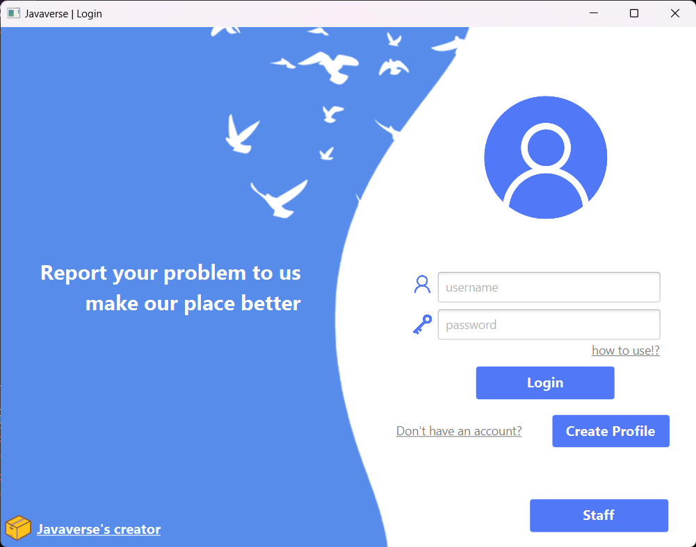

# Javaverse


---

### ขั้นตอนการติดตั้งโปรแกรม
1. ดาวน์โหลดโปรแกรมจาก [Releases](https://github.com/CS211-651/project211-javaverse/releases/)
2. ทำการ Extract file Project.zip ออกมา
3. ทำการ Run CS211-Project-1.0-SNAPSHOT-shaded.jar เพื่อเปิดใช้งานโปรแกรม
---

## Roadmap
- การส่งครั้งที่ 1
	- ออกแบบ, วางแผน และแบ่งหน้าที่การทำงานกันในกลุ่ม
- การส่งครั้งที่ 2
	- ส่วนที่ทำเสร็จ
		- หน้า Register
		- หน้า Login Student 
		- หน้าจัดการ Student ของ Admin
- การส่งครั้งที่ 3
	- เริ่มทำในส่วนของ Staff และ หน้า Register Staff ของ Admin 


---
#### การวางโครงสร้างไฟล์
```
+---java
|   |   module-info.java
|   |   
|   \---ku
|       \---cs
|           |   Main.java
|           |   ProjectApplication.java
|           |   ProjectController.java
|           |   
|           +---com
|           |   \---github
|           |       \---saacsos
|           |           \---fxrouter-1.0.0
|           |                               
|           +---controllers
|           |       AdminChangePasswordController.java
|           |       AdminController.java
|           |       AdminStaffListController.java
|           |       AdminStudentListController.java
|           |       CreatorController.java
|           |       DetailController.java
|           |       HomeController.java
|           |       LoginStaffController.java
|           |       MainController.java
|           |       ProfileController.java
|           |       RegisterController.java
|           |       RegisterStaffController.java
|           |       ReportFormController.java
|           |       SignInController.java
|           |       StaffController.java
|           |       
|           +---models
|           |       AdminModels.java
|           |       Category.java
|           |       CategoryList.java
|           |       Choice.java
|           |       RegistersimpleStringproperty.java
|           |       ReportList.java
|           |       ReportModel.java
|           |       User.java
|           |       UserList.java
|           |       
|           \---services
|                   AdminReadFile.java
|                   DataSource.java
|                   LoginStaffWriteFile.java
|                   RegisterWriteFile.java
|                   ReportWriteFile.java
|                   SignInWriteFile.java
|                   SortList.java
|                   StringConfig.java
|                   
\---resources
    +---images
    |   |   background_1.png
    |   |   background_2.png
    |   |   background_3.png
    |   |   background_4.png
    |   |   background_5.png
    |   |   background_6.png
    |   |   background_7.png
    |   |   beam.jpg
    |   |   boss.jpg
    |   |   default.jpg
    |   |   default1.png
    |   |   euro.jpg
    |   |   joy.jpg
    |   |   
    |   \---icon
    |           icon_1.png
    |           icon_2.png
    |           icon_3.png
    |           icon_4.png
    |           icon_5.png
    |           icon_6.png
    |           icon_7.png
    |           icon_8.png
    |           icon_9.png
    |           icon_pw.png
    |           icon_user.png
    |           icon_user_2.png
    |           icon_vote.png
    |           
    +---ku
    |   \---cs
    |           admin.fxml
    |           adminChangePassword.fxml
    |           adminStaffList.fxml
    |           adminStudentList.fxml
    |           creator.fxml
    |           detail.fxml
    |           for_staff.fxml
    |           home.fxml
    |           loginStaff.fxml
    |           main.fxml
    |           profile.fxml
    |           project.fxml
    |           register.fxml
    |           registerStaff.fxml
    |           report_form.fxml
    |           signIn.fxml
    |           
    \---picture
```
---


<!--
Old README.md

CS211 - Project
วิธีทดสอบการ RUN
1. Main 
run Main Class
2. javafx plugin
MVN Clean
javafx -> javafx:run

วิธีสร้าง Jar
MVN Clean
MVN install
file จะอยู่ใน target เป็น shade.jar
-->


 
