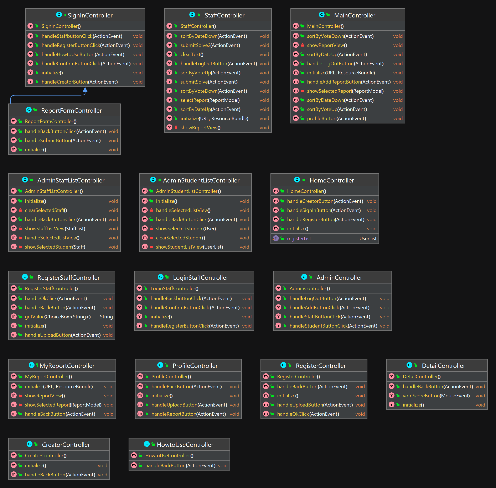

# Javaverse


---

### ขั้นตอนการติดตั้งโปรแกรม
1. ดาวน์โหลดโปรแกรมจาก [Releases](https://github.com/CS211-651/project211-javaverse/releases/)
2. ทำการ Extract file Project.zip ออกมา
3. ทำการ Run CS211-Project-1.0-SNAPSHOT-shaded.jar เพื่อเปิดใช้งานโปรแกรม
- ปล.หน้าต้องการดูวิธีการใช้งาน/การทำงานของโปรเเกรมJavaverse โปรดเช็คใน [PDF](วิธีการใช้งานโปรแกรมjavaverse.pdf)

---

## Roadmap
- การส่งครั้งที่ 1
	- ออกแบบ, วางแผน และแบ่งหน้าที่การทำงานกันในกลุ่ม
- การส่งครั้งที่ 2
	- ส่วนที่ทำเสร็จ
		- หน้า Register
		- หน้า Login Student
		- หน้าจัดการ Student ของ Admin
- การส่งครั้งที่ 3
	- เริ่มทำในส่วนของ Staff และ หน้า Register Staff ของ Admin
---
## UML Class Diagram

- #### Controller Class

---
- #### Model Class

---
- #### Utility Class


---
#### การวางโครงสร้างไฟล์
```
*
├───filescsv                                                    	  // เก็บ Data csv ทั้งหมด
│		report.csv
│		staff.csv
│		student.csv
└───src
	│ 
	└───main
		├───java
		│   │   module-info.java
		│   └───ku
		│       └───cs
		│           │   Main.java
		│           │   ProjectApplication.java					
		│           │   ProjectController.java
		│           ├───controllers                               // เก็บ Controllers
		│           │       AdminController.java			
		│           │       AdminStaffListController.java
		│           │       AdminStudentListController.java
		│           │       CreatorController.java
		│           │       DetailController.java
		│           │       HomeController.java
		│           │       HowtoUseController.java
		│           │       LoginStaffController.java
		│           │       MainController.java
		│           │       MyReportController.java
		│           │       ProfileController.java
		│           │       RegisterController.java
		│           │       RegisterStaffController.java
		│           │       ReportFormController.java
		│           │       SignInController.java
		│           │       StaffController.java    
		│           ├───models                                    // เก็บ Models
		│           │       AdminModels.java
		│           │       Category.java
		│           │       CategoryList.java
		│           │       Choice.java
		│           │       RegistersimpleStringproperty.java
		│           │       ReportList.java
		│           │       ReportModel.java
		│           │       Staff.java
		│           │       StaffList.java
		│           │       User.java
		│           │       UserList.java 
		│           └───services                                  // เก็บ Services  
		│                   DataSource.java
		│                   LoginStaffWriteFile.java
		│                   RegisterWriteFile.java
		│                   ReportWriteFile.java
		│                   SignInWriteFile.java
		│                   SortList.java
		│                   StringConfig.java           
		└───resources                                             // เก็บ Data ภาพ ทั้งหมด
			├───images  
			│   └───icon     
			└───ku
				└───cs                                    // เก็บ FXML ทั้งหมด
					admin.fxml
					adminStaffList.fxml
					adminStudentList.fxml
					creator.fxml
					detail.fxml
					for_staff.fxml
					home.fxml
					howTouse.fxml
					loginStaff.fxml
					main.fxml
					myreport.fxml
					profile.fxml
					project.fxml
					register.fxml
					registerStaff.fxml
					report_form.fxml
					signIn.fxml
```
---


<!--
Old README.md

CS211 - Project
วิธีทดสอบการ RUN
1. Main 
run Main Class
2. javafx plugin
MVN Clean
javafx -> javafx:run

วิธีสร้าง Jar
MVN Clean
MVN install
file จะอยู่ใน target เป็น shade.jar
-->


 
